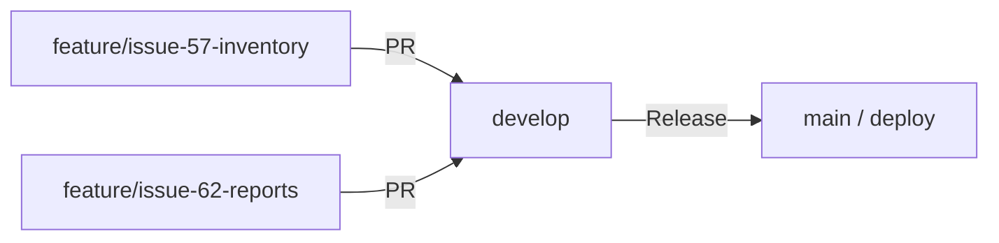

# 🤝 Guía de Contribución / Contributing Guide

---

# 🇪🇸 Español

¡Gracias por tu interés en contribuir a **Veterinaria SOS**! Este documento te guiará paso a paso.

## Cómo contribuir

### 1. Haz un Fork

Haz clic en el botón **Fork** en la parte superior derecha del repositorio.

### 2. Clona tu Fork

```bash
git clone https://github.com/TU_USUARIO/Veterinaria.git
cd Veterinaria
```

### 3. Crea una rama

Usa una convención de nombres descriptiva:

```bash
git checkout -b feature/nombre-de-la-funcionalidad
git checkout -b fix/descripcion-del-bug
git checkout -b docs/mejora-documentacion
```

### 4. Realiza tus cambios

- Sigue el estilo de código existente del proyecto.
- Asegúrate de que el proyecto compila sin errores: `mvnw.cmd clean compile`
- No incluyas credenciales ni archivos de configuración local.

### 5. Haz commit con mensajes claros

Usa [Conventional Commits](https://www.conventionalcommits.org/):

```bash
git commit -m "feat: agregar filtro de búsqueda en inventario"
git commit -m "fix: corregir cálculo de subtotal en ventas"
git commit -m "docs: actualizar README con instrucciones de instalación"
```

### 6. Push y Pull Request

```bash
git push origin feature/nombre-de-la-funcionalidad
```

Luego abre un **Pull Request** desde GitHub hacia la rama `develop`.

## Estrategia de Ramificación (Branching Strategy)

Este proyecto sigue un flujo de trabajo Git estructurado para mantener la estabilidad del código en producción:



### Ramas principales

| Rama | Propósito | Protección |
|---|---|---|
| **`main`** / **`deploy`** | Rama de producción, siempre estable y desplegable. | Protegida: solo merge desde `develop` vía PR aprobado. |
| **`develop`** | Rama de integración donde se unen todas las nuevas características antes de ir a producción. | Protegida: solo merge desde ramas `feature/*` vía PR. |

### Ramas de características

- Se crean **siempre** a partir de `develop`.
- Formato obligatorio: `feature/nombre-del-ticket` (ej. `feature/issue-57-inventory-deduction`).
- También se aceptan: `fix/descripcion-del-bug`, `docs/mejora-documentacion`.

```bash
# Crear una rama de característica
git checkout develop
git pull origin develop
git checkout -b feature/issue-57-inventory-deduction
```

### Pull Requests

- **Todos los PRs deben apuntar a `develop`**, nunca directamente a `main`/`deploy`.
- El merge a `main`/`deploy` se realiza únicamente cuando `develop` está estable y listo para un release.
- Cada PR debe incluir una descripción clara de los cambios realizados.

### Flujo completo

1. Crear rama `feature/*` desde `develop`.
2. Desarrollar y hacer commits con [Conventional Commits](https://www.conventionalcommits.org/).
3. Abrir PR hacia `develop`.
4. Code review + aprobación.
5. Merge a `develop`.
6. Cuando `develop` esté listo para release → merge a `main`/`deploy`.

## Reglas del proyecto

- **Idioma del código:** Variables y clases en español (consistente con el proyecto existente).
- **Idioma de la documentación:** Bilingüe (Español + Inglés).
- **Base de datos:** No incluir scripts destructivos (`DROP TABLE`) sin autorización.
- **Seguridad:** NUNCA hacer commit de contraseñas, tokens o credenciales.
- **Testing:** Se recomienda agregar tests unitarios con JUnit 5 para nuevas funcionalidades.

## Reportar Bugs

Abre un [Issue](https://github.com/Dabji/Veterinaria/issues) con la siguiente información:

1. **Descripción** del bug.
2. **Pasos para reproducir** el error.
3. **Comportamiento esperado** vs. comportamiento actual.
4. **Screenshots** si aplica.
5. **Entorno:** SO, versión de Java, versión de PostgreSQL.

---
---

# 🇺🇸 English

Thank you for your interest in contributing to **Veterinaria SOS**! This document will guide you step by step.

## How to Contribute

### 1. Fork the repo

Click the **Fork** button in the top-right corner of the repository.

### 2. Clone your fork

```bash
git clone https://github.com/YOUR_USERNAME/Veterinaria.git
cd Veterinaria
```

### 3. Create a branch

Use a descriptive naming convention:

```bash
git checkout -b feature/feature-name
git checkout -b fix/bug-description
git checkout -b docs/documentation-improvement
```

### 4. Make your changes

- Follow the existing code style of the project.
- Ensure the project compiles without errors: `mvnw.cmd clean compile`
- Do not include credentials or local configuration files.

### 5. Commit with clear messages

Use [Conventional Commits](https://www.conventionalcommits.org/):

```bash
git commit -m "feat: add search filter to inventory"
git commit -m "fix: correct subtotal calculation in sales"
git commit -m "docs: update README with installation instructions"
```

### 6. Push and Pull Request

```bash
git push origin feature/feature-name
```

Then open a **Pull Request** from GitHub targeting the `develop` branch.

## Branching Strategy

This project follows a structured Git workflow to maintain production code stability:


### Main Branches

| Branch | Purpose | Protection |
|---|---|---|
| **`main`** / **`deploy`** | Production branch, always stable and deployable. | Protected: only merge from `develop` via approved PR. |
| **`develop`** | Integration branch where all new features are merged before going to production. | Protected: only merge from `feature/*` branches via PR. |

### Feature Branches

- Always created **from `develop`**.
- Required format: `feature/ticket-name` (e.g., `feature/issue-57-inventory-deduction`).
- Also accepted: `fix/bug-description`, `docs/documentation-improvement`.

```bash
# Create a feature branch
git checkout develop
git pull origin develop
git checkout -b feature/issue-57-inventory-deduction
```

### Pull Requests

- **All PRs must target `develop`**, never directly to `main`/`deploy`.
- Merging to `main`/`deploy` is done only when `develop` is stable and ready for a release.
- Each PR must include a clear description of the changes made.

### Complete Workflow

1. Create `feature/*` branch from `develop`.
2. Develop and commit using [Conventional Commits](https://www.conventionalcommits.org/).
3. Open PR targeting `develop`.
4. Code review + approval.
5. Merge to `develop`.
6. When `develop` is ready for release → merge to `main`/`deploy`.

## Project Rules

- **Code language:** Variables and classes in Spanish (consistent with existing project).
- **Documentation language:** Bilingual (Spanish + English).
- **Database:** Do not include destructive scripts (`DROP TABLE`) without authorization.
- **Security:** NEVER commit passwords, tokens, or credentials.
- **Testing:** Adding JUnit 5 unit tests for new features is recommended.

## Reporting Bugs

Open an [Issue](https://github.com/Dabji/Veterinaria/issues) with the following information:

1. **Description** of the bug.
2. **Steps to reproduce** the error.
3. **Expected behavior** vs. actual behavior.
4. **Screenshots** if applicable.
5. **Environment:** OS, Java version, PostgreSQL version.
