<p align="center">
  
</p>

<h1 align="center">🐾 Veterinaria SOS — Enterprise Management System</h1>

<p align="center">
  <strong>Sistema integral de gestión para clínicas veterinarias</strong><br/>
  <em>Comprehensive management system for veterinary clinics</em>
</p>

<p align="center">
  
  
  
  
  
  
  
  
</p>

<p align="center">
  <a href="#-español">Español</a> · <a href="#-english">English</a>
</p>

---

<p align="center">
  
  <br/>
  <em>📹 Demo completa del sistema / Full system demo</em>
</p>

---

# 🇪🇸 Español

## Acerca del Proyecto

**Veterinaria SOS** es un sistema de gestión empresarial (ERP) diseñado para clínicas veterinarias. Fue desarrollado como MVP académico para la materia de **Ingeniería de Software** (4to semestre) en la **Universidad Pontificia Bolivariana (UPB)**, obteniendo una calificación de **5.0/5.0**.

El sistema permite administrar clientes, mascotas, inventario (medicamentos, alimentos, accesorios, material quirúrgico), proveedores, ventas (POS), historial clínico, usuarios con permisos modulares y recuperación de contraseña por email con código OTP.

## Galería de Interfaces (UI Showcase)

<table>
  <tr>
    <td align="center" width="50%">
      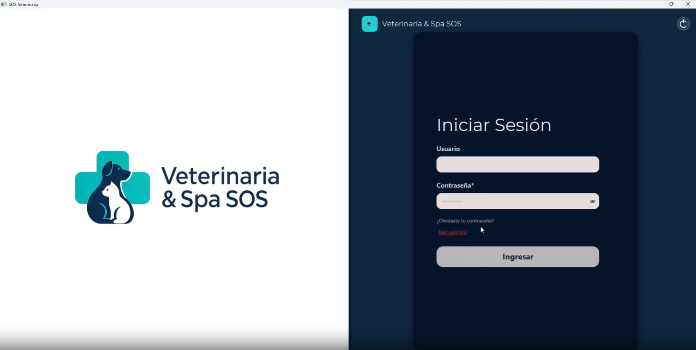
      <br/><strong>Inicio de Sesión</strong>
    </td>
    <td align="center" width="50%">
      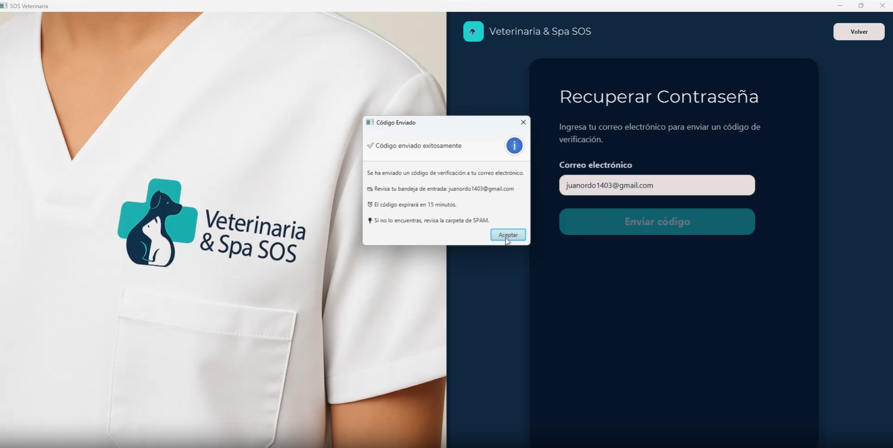
      <br/><strong>Recuperación de Contraseña (OTP)</strong>
    </td>
  </tr>
  <tr>
    <td align="center">
      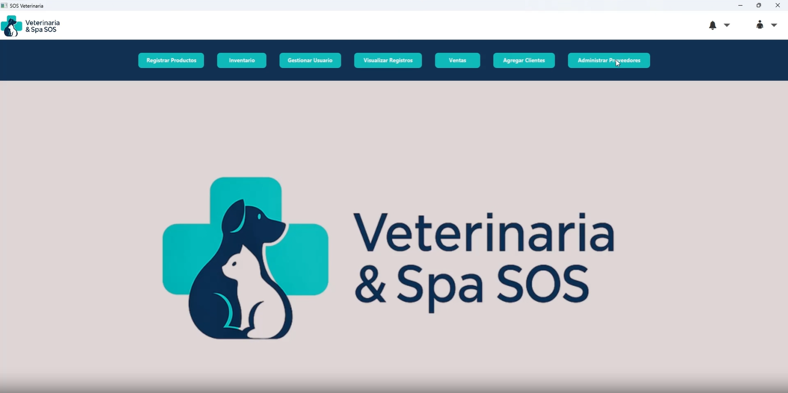
      <br/><strong>Panel Principal / Dashboard</strong>
    </td>
    <td align="center">
      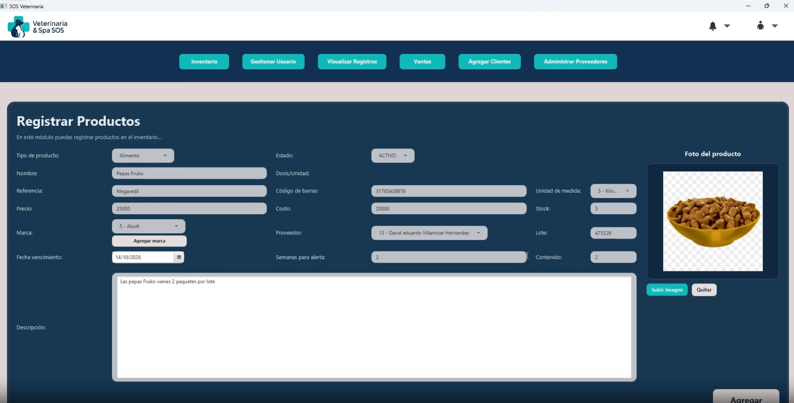
      <br/><strong>Registro de Productos</strong>
    </td>
  </tr>
  <tr>
    <td align="center">
      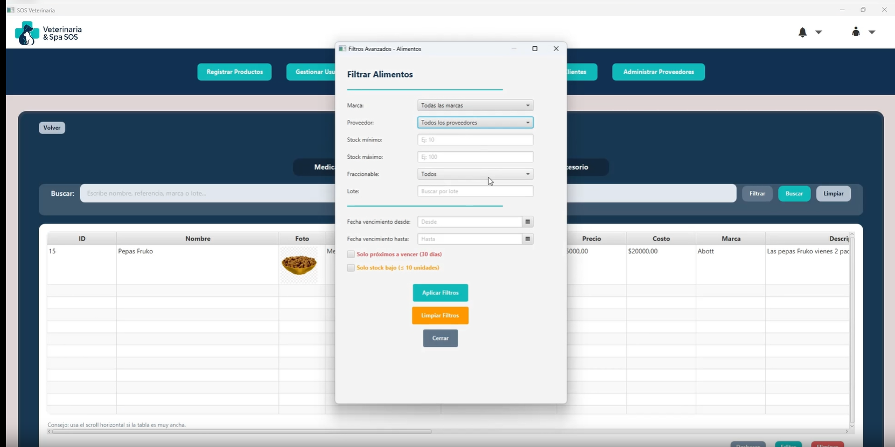
      <br/><strong>Inventario con Filtros Avanzados</strong>
    </td>
    <td align="center">
      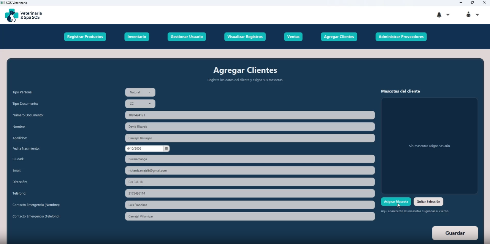
      <br/><strong>Registro de Clientes</strong>
    </td>
  </tr>
  <tr>
    <td align="center">
      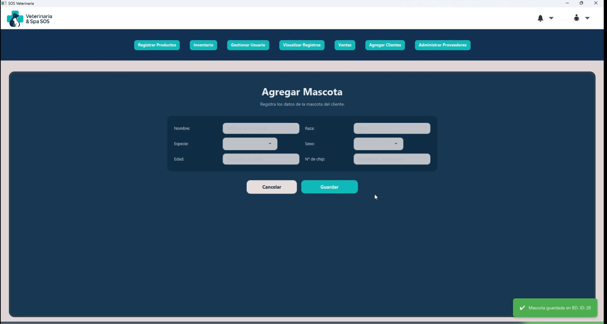
      <br/><strong>Registro de Mascotas</strong>
    </td>
    <td align="center">
      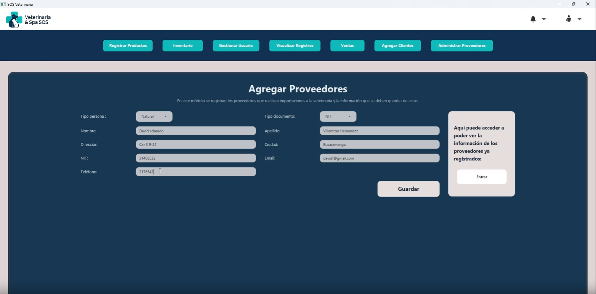
      <br/><strong>Registro de Proveedores</strong>
    </td>
  </tr>
  <tr>
    <td align="center">
      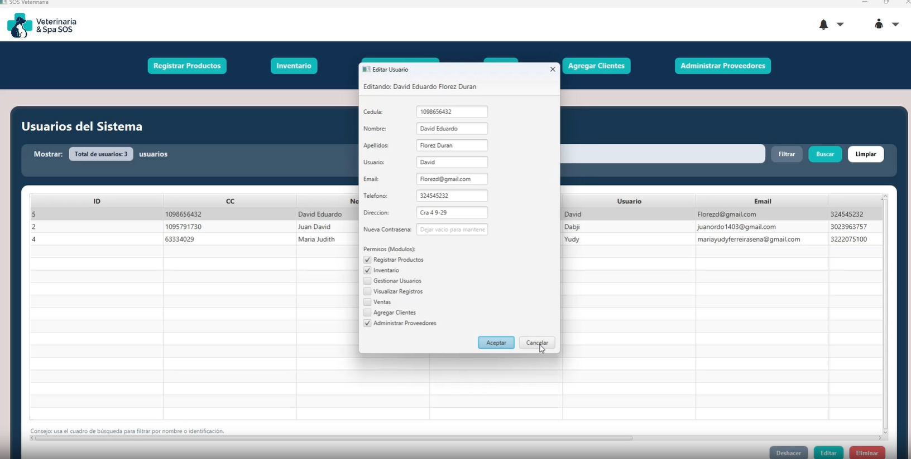
      <br/><strong>Gestión de Usuarios</strong>
    </td>
    <td align="center">
      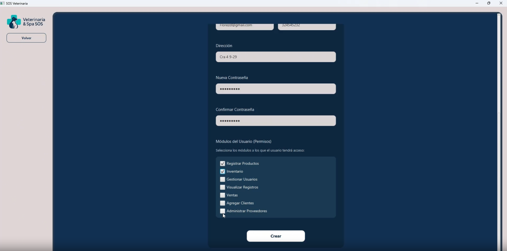
      <br/><strong>Permisos por Módulo</strong>
    </td>
  </tr>
  <tr>
    <td align="center">
      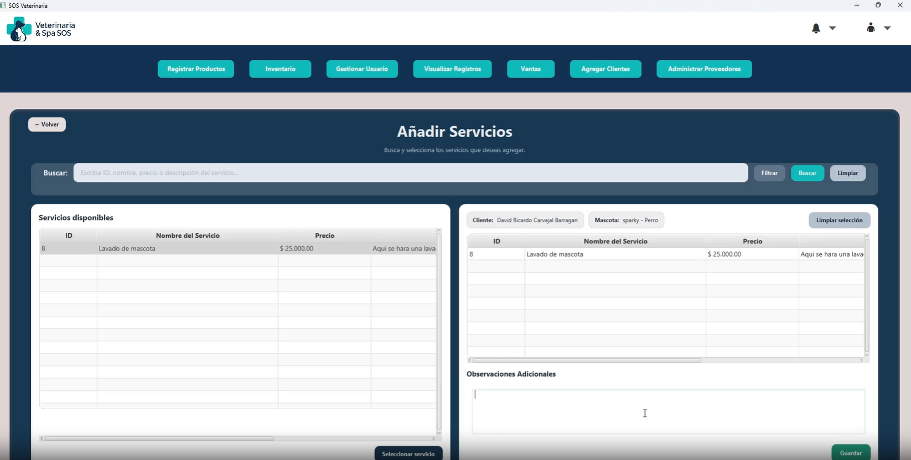
      <br/><strong>Servicios e Historial Clínico</strong>
    </td>
    <td align="center">
      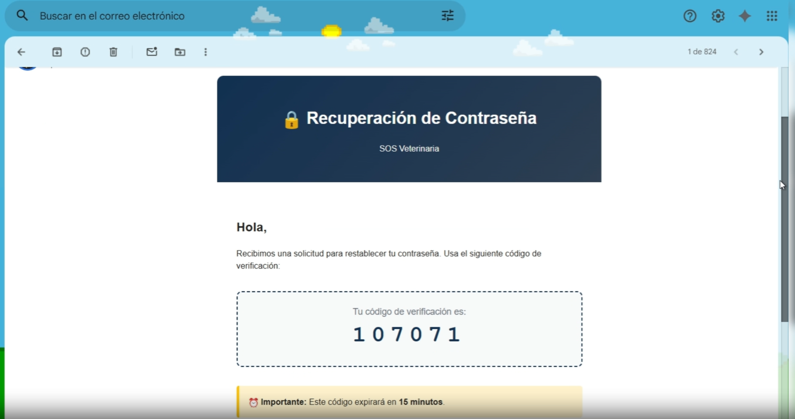
      <br/><strong>Email OTP Recibido</strong>
    </td>
  </tr>
</table>

## Stack Tecnológico

| Capa | Tecnología |
|---|---|
| **Lenguaje** | Java 23 |
| **UI Framework** | JavaFX 17 (FXML + CSS) |
| **Build Tool** | Apache Maven 3.9 |
| **Base de Datos** | PostgreSQL 15+ |
| **Connection Pool** | HikariCP 5.0 |
| **Migraciones** | Flyway |
| **Seguridad** | BCrypt (hashing de contraseñas) |
| **Email** | JavaMail API (SMTP / Gmail) |
| **Patrón de Datos** | DAO con JDBC |
| **Arquitectura** | MVC (Model-View-Controller) |

## Arquitectura del Sistema


## Modelo Entidad-Relación (ERD)

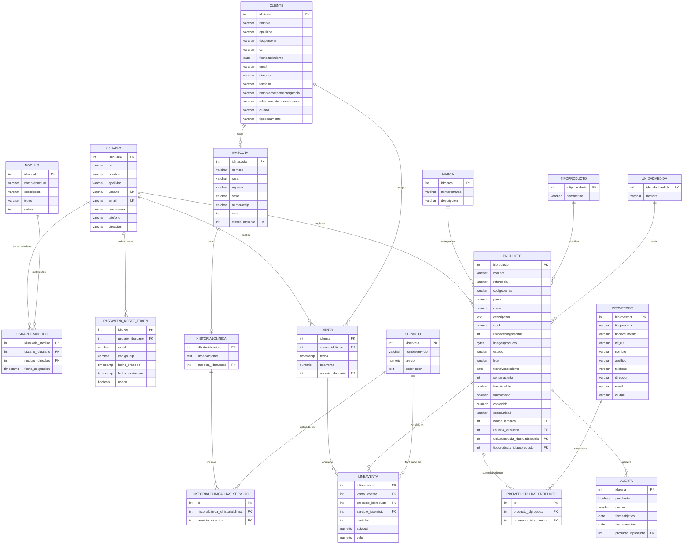

## Base de Datos

Para instrucciones detalladas de configuración de la base de datos, por favor consulta la **[Guía de Base de Datos (DATABASE_SETUP.md)](DATABASE_SETUP.md)**.

El script DDL completo se encuentra en [`sql/init_schema.sql`](sql/init_schema.sql). Los datos de prueba están en [`sql/seed_data.sql`](sql/seed_data.sql).

## Estructura del Proyecto

```
Veterinaria/
├── src/main/java/co/edu/upb/veterinaria/
│   ├── app/                    # Punto de entrada (Principal.java)
│   ├── config/                 # Configuración (DatabaseConfig)
│   ├── controllers/            # Controladores JavaFX (MVC)
│   ├── models/                 # Modelos / Entidades (POJOs)
│   ├── repositories/           # Capa DAO (acceso a BD con JDBC)
│   └── services/               # Lógica de negocio
├── src/main/resources/
│   └── co/edu/upb/veterinaria/
│       ├── views/              # Archivos FXML
│       ├── styles/             # Hojas de estilo CSS
│       └── images/             # Recursos gráficos
├── sql/
│   ├── init_schema.sql         # DDL completo de la base de datos
│   └── seed_data.sql           # Datos de prueba reales
├── docs/assets/                # Capturas de pantalla del sistema
├── .env.example                # Plantilla de variables de entorno
├── DATABASE_SETUP.md           # Guía de configuración de BD
├── CONTRIBUTING.md             # Guía de contribución
├── CODE_OF_CONDUCT.md          # Código de conducta
├── SECURITY.md                 # Política de seguridad
├── CHANGELOG.md                # Registro de cambios
├── LICENSE                     # Licencia MIT
└── pom.xml                     # Configuración Maven
```

## Inicio Rápido

### Prerrequisitos

- **Java JDK 23** o superior
- **Maven 3.9+**
- **PostgreSQL 15+** en ejecución

### Instalación

```bash
# 1. Clonar el repositorio
git clone https://github.com/tu-usuario/Veterinaria.git
cd Veterinaria

# 2. Configurar la base de datos (ver DATABASE_SETUP.md)
psql -U postgres -d postgres -f sql/init_schema.sql

# 3. Configurar variables de entorno
cp .env.example .env
# Editar .env con tus credenciales

# 4. Compilar y ejecutar
./mvnw clean javafx:run
```

## Funcionalidades Principales

- **Autenticación segura** con BCrypt y recuperación por email (OTP)
- **Gestión de usuarios** con permisos modulares granulares
- **Registro de clientes** con contacto de emergencia y mascotas asociadas
- **Inventario completo** (Medicamentos, Alimentos, Material Quirúrgico, Accesorios)
- **Punto de Venta (POS)** con líneas de venta para productos y servicios
- **Historial Clínico** por mascota con servicios asociados
- **Alertas automáticas** de vencimiento y stock bajo
- **Gestión de Proveedores** con relación N:N a productos

## 🤝 Contribuir

Las contribuciones son bienvenidas. Sigue estos pasos:

1. **Crea un fork** del repositorio.
2. **Crea una rama** para tu feature: `git checkout -b feature/mi-feature`.
3. **Haz commit** de tus cambios: `git commit -m "feat: descripción del cambio"`.
4. **Sube tu rama**: `git push origin feature/mi-feature`.
5. **Abre un Pull Request** describiendo tus cambios.

📖 Consulta la **[Guía de Contribución](CONTRIBUTING.md)** para convenciones de código, commits y flujo de trabajo.

🤝 Lee nuestro **[Código de Conducta](CODE_OF_CONDUCT.md)** antes de participar.

## 🔒 Seguridad

Si descubres una vulnerabilidad de seguridad, **NO abras un issue público**. Consulta nuestra **[Política de Seguridad](SECURITY.md)** para el proceso de reporte responsable.

## 📄 Licencia

Este proyecto está licenciado bajo la **Licencia MIT** — libre para uso, modificación y distribución. Ver [`LICENSE`](LICENSE) para más información.

---

<p align="center">
  <strong>Hecho con ❤️ por el equipo de desarrollo</strong><br/>
  Universidad Pontificia Bolivariana<br/>
  <em>Proyecto de Aula · Ingeniería de Software · Ingeniería de Sistemas e Informática · 2025-2026</em>
</p>

---
---

# 🇺🇸 English

## About the Project

**Veterinaria SOS** is an enterprise resource planning (ERP) system designed for veterinary clinics. It was developed as an academic MVP for the **Software Engineering** course (4th semester) at **Universidad Pontificia Bolivariana (UPB)**, achieving a grade of **5.0/5.0**.

The system manages clients, pets, inventory (medications, food, accessories, surgical materials), suppliers, sales (POS), clinical history, users with modular permissions, and email-based password recovery with OTP codes.

## UI Showcase Gallery

<table>
  <tr>
    <td align="center" width="50%">
      
      <br/><strong>Login Screen</strong>
    </td>
    <td align="center" width="50%">
      
      <br/><strong>Password Recovery (OTP)</strong>
    </td>
  </tr>
  <tr>
    <td align="center">
      
      <br/><strong>Main Dashboard</strong>
    </td>
    <td align="center">
      
      <br/><strong>Product Registration</strong>
    </td>
  </tr>
  <tr>
    <td align="center">
      
      <br/><strong>Inventory with Advanced Filters</strong>
    </td>
    <td align="center">
      
      <br/><strong>Client Registration</strong>
    </td>
  </tr>
  <tr>
    <td align="center">
      
      <br/><strong>Pet Registration</strong>
    </td>
    <td align="center">
      
      <br/><strong>Supplier Registration</strong>
    </td>
  </tr>
  <tr>
    <td align="center">
      
      <br/><strong>User Management</strong>
    </td>
    <td align="center">
      
      <br/><strong>Module Permissions</strong>
    </td>
  </tr>
  <tr>
    <td align="center">
      
      <br/><strong>Services & Clinical History</strong>
    </td>
    <td align="center">
      
      <br/><strong>OTP Email Received</strong>
    </td>
  </tr>
</table>

## Technology Stack

| Layer | Technology |
|---|---|
| **Language** | Java 23 |
| **UI Framework** | JavaFX 17 (FXML + CSS) |
| **Build Tool** | Apache Maven 3.9 |
| **Database** | PostgreSQL 15+ |
| **Connection Pool** | HikariCP 5.0 |
| **Migrations** | Flyway |
| **Security** | BCrypt (password hashing) |
| **Email** | JavaMail API (SMTP / Gmail) |
| **Data Pattern** | DAO with JDBC |
| **Architecture** | MVC (Model-View-Controller) |

## System Architecture

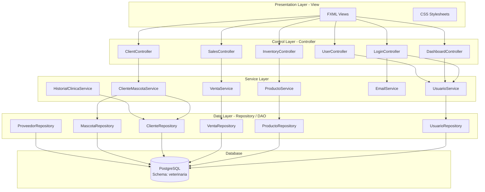

## Entity-Relationship Diagram (ERD)

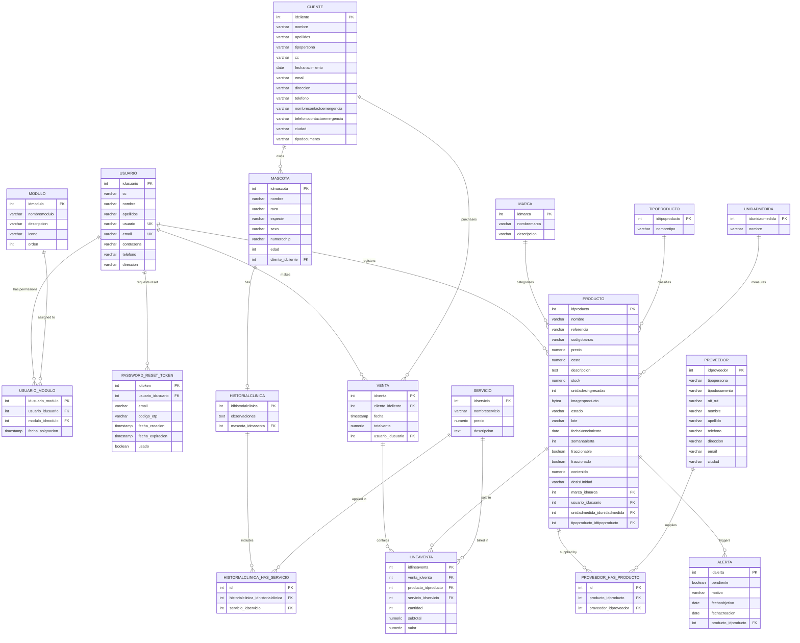

## Database

For detailed database setup instructions, please refer to the **[Database Setup Guide (DATABASE_SETUP.md)](DATABASE_SETUP.md)**.

The complete DDL script is available at [`sql/init_schema.sql`](sql/init_schema.sql). Test data is in [`sql/seed_data.sql`](sql/seed_data.sql).

## Project Structure

```
Veterinaria/
├── src/main/java/co/edu/upb/veterinaria/
│   ├── app/                    # Entry point (Principal.java)
│   ├── config/                 # Configuration (DatabaseConfig)
│   ├── controllers/            # JavaFX Controllers (MVC)
│   ├── models/                 # Models / Entities (POJOs)
│   ├── repositories/           # DAO Layer (DB access with JDBC)
│   └── services/               # Business logic
├── src/main/resources/
│   └── co/edu/upb/veterinaria/
│       ├── views/              # FXML files
│       ├── styles/             # CSS stylesheets
│       └── images/             # Graphic resources
├── sql/
│   ├── init_schema.sql         # Full database DDL
│   └── seed_data.sql           # Real test data
├── docs/assets/                # System screenshots
├── .env.example                # Environment variables template
├── DATABASE_SETUP.md           # Database setup guide
├── CONTRIBUTING.md             # Contribution guide
├── CODE_OF_CONDUCT.md          # Code of conduct
├── SECURITY.md                 # Security policy
├── CHANGELOG.md                # Changelog
├── LICENSE                     # MIT License
└── pom.xml                     # Maven configuration
```

## Quick Start

### Prerequisites

- **Java JDK 23** or higher
- **Maven 3.9+**
- **PostgreSQL 15+** running

### Installation

```bash
# 1. Clone the repository
git clone https://github.com/your-user/Veterinaria.git
cd Veterinaria

# 2. Set up the database (see DATABASE_SETUP.md)
psql -U postgres -d postgres -f sql/init_schema.sql

# 3. Configure environment variables
cp .env.example .env
# Edit .env with your credentials

# 4. Build and run
./mvnw clean javafx:run
```

## Key Features

- **Secure authentication** with BCrypt and email recovery (OTP)
- **User management** with granular modular permissions
- **Client registration** with emergency contacts and associated pets
- **Complete inventory** (Medications, Food, Surgical Materials, Accessories)
- **Point of Sale (POS)** with sale lines for products and services
- **Clinical History** per pet with associated services
- **Automatic alerts** for expiration and low stock
- **Supplier management** with N:N product relationships

## 🤝 Contributing

Contributions are welcome. Follow these steps:

1. **Fork** the repository.
2. **Create a branch** for your feature: `git checkout -b feature/my-feature`.
3. **Commit** your changes: `git commit -m "feat: description of change"`.
4. **Push** your branch: `git push origin feature/my-feature`.
5. **Open a Pull Request** describing your changes.

📖 Check the **[Contribution Guide](CONTRIBUTING.md)** for code conventions, commits, and workflow.

🤝 Read our **[Code of Conduct](CODE_OF_CONDUCT.md)** before participating.

## 🔒 Security

If you discover a security vulnerability, **DO NOT open a public issue**. See our **[Security Policy](SECURITY.md)** for the responsible disclosure process.

## 📄 License

This project is licensed under the **MIT License** — free for use, modification, and distribution. See [`LICENSE`](LICENSE) for more information.

---

<p align="center">
  <strong>Made with ❤️ by the development team</strong><br/>
  Universidad Pontificia Bolivariana<br/>
  <em>Classroom Project · Software Engineering · Systems and Informatics Engineering · 2025-2026</em>
</p>
